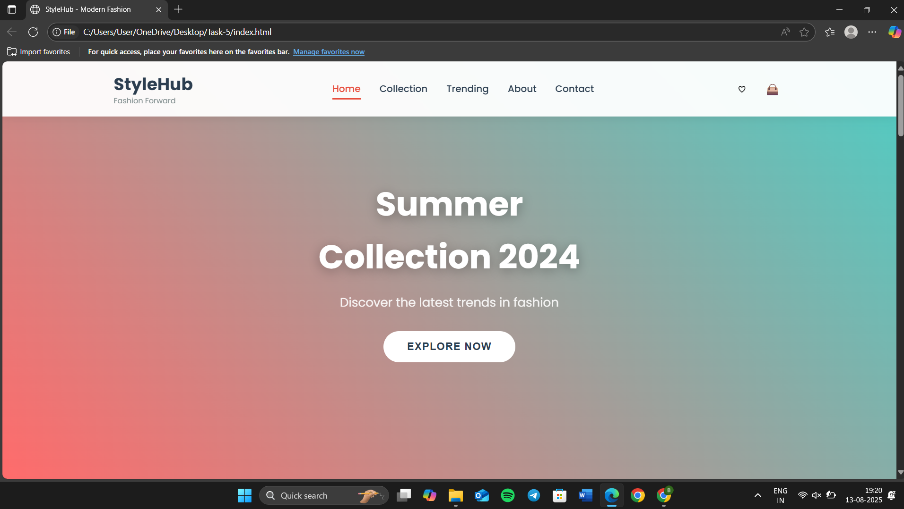
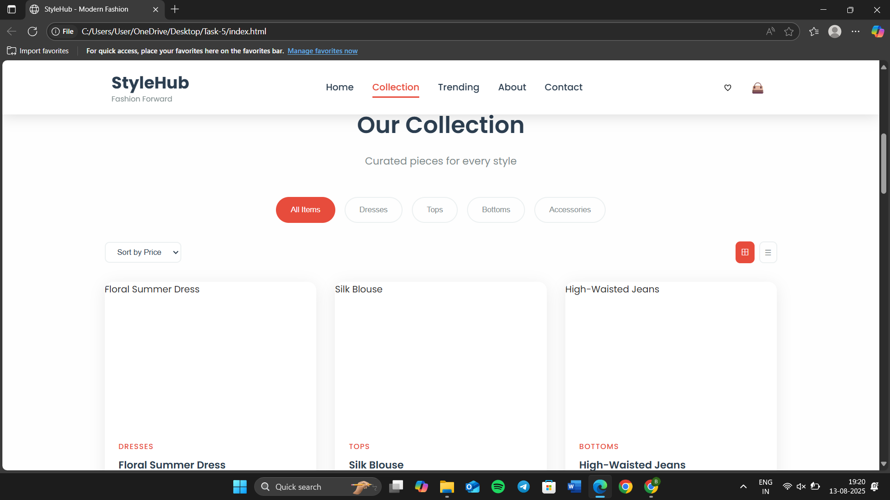
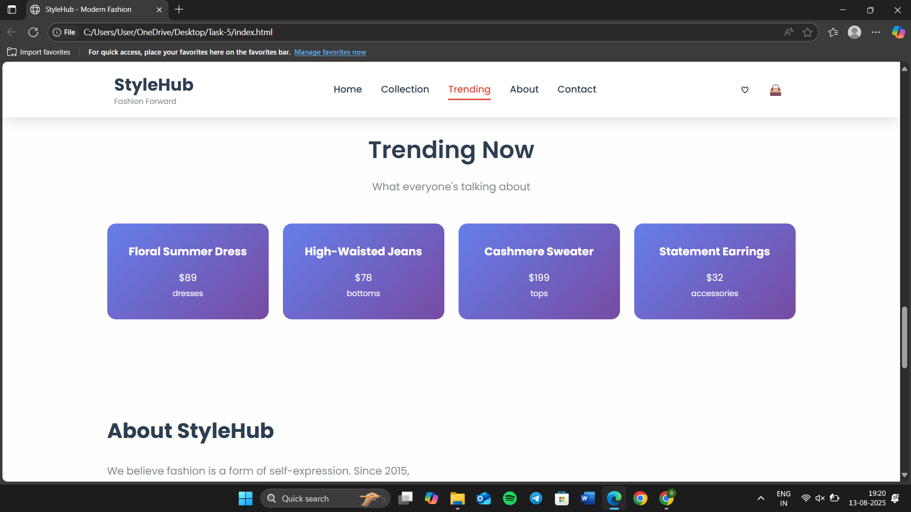
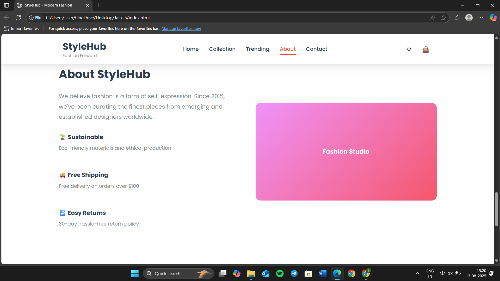
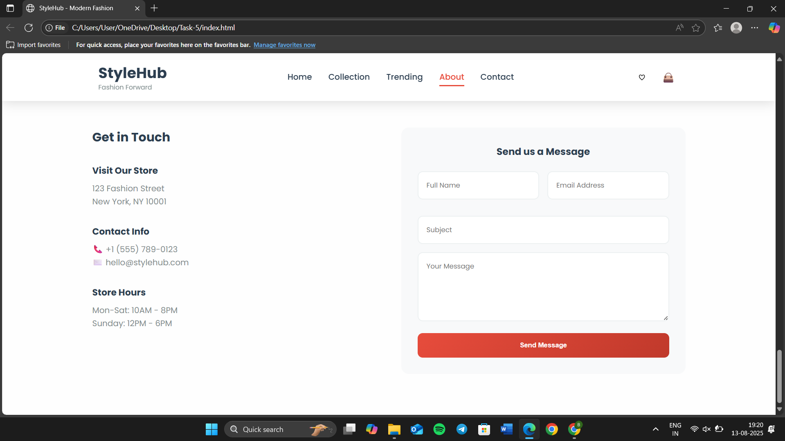

# TASK-5-WEB-DEVELOPMENT

This project is a **capstone-level web development task** completed during my internship at **Apex Planet Software Pvt. Ltd.**  
It integrates all my learning into a **comprehensive, responsive, and performance-optimized web application** built with **HTML, CSS, and JavaScript**.

---

## 🎯 Objective
- Combine all skills into a complete web application.
- Ensure fast loading speed and smooth performance.
- Guarantee mobile responsiveness and cross-browser compatibility.

---

## 🧩 Features
- **Fully Responsive Design** – Works flawlessly on desktops, tablets, and mobiles.
- **Cross-Browser Compatibility** – Tested on Chrome, Firefox, Safari, and Edge.
- **Optimized Performance** – Minimized CSS/JS, lazy loading for images, and reduced HTTP requests.
- **Dynamic Content** – Interactive UI elements powered by JavaScript.
- **Clean UI/UX** – Modern, intuitive, and visually consistent interface.

---

## 🔧 Technologies Used
- **HTML5** – Semantic, structured markup.
- **CSS3** – Flexbox, Grid, responsive styling.
- **JavaScript (ES6)** – Dynamic functionality and user interactivity.

---

## 📂 File Structure

-index.html
-style.css
-script.js

---

## ▶️ How to Run
1. **Download or Clone** this repository:
   git clone https://github.com/bharti-johari/TASK-5-WEB-DEVELOPMENT.git
2. **Open** `index.html` in your browser.
3. Experience the optimized and responsive web app.

---

## 📸 Screenshots

---

## 👩‍💻 Created By

**Bharti Johari**
Intern @ Apex Planet Software Pvt. Ltd.
BTech CSE (AI & ML) | Sanskriti University
**Web Development Enthusiast**

## 🚀 Live Demo

